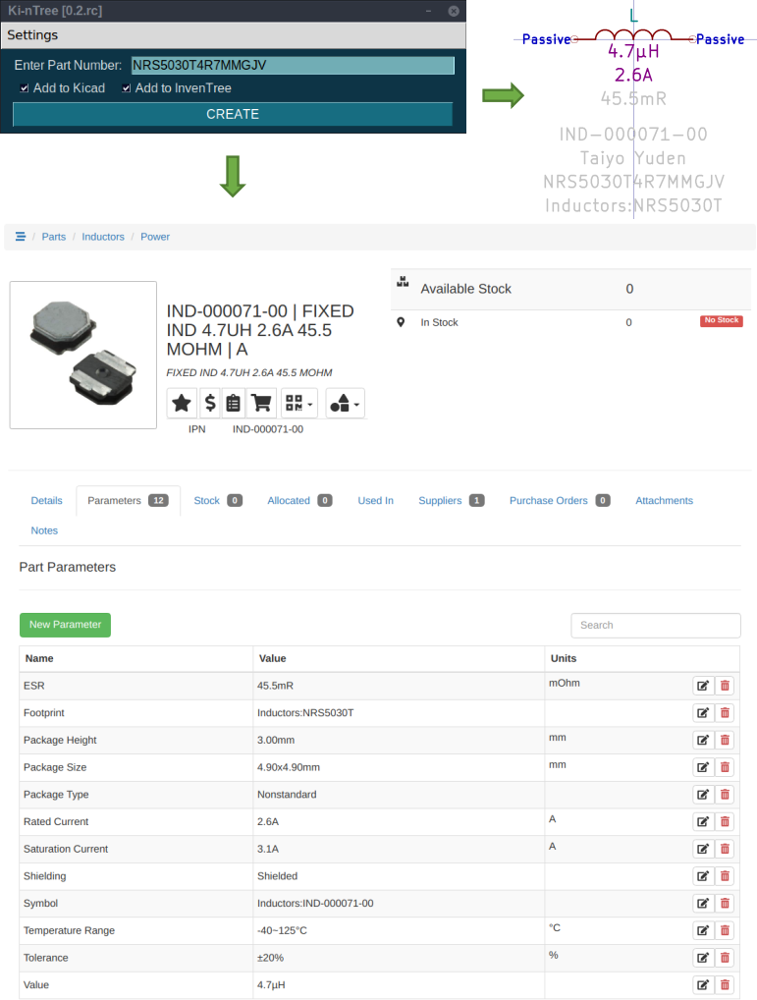
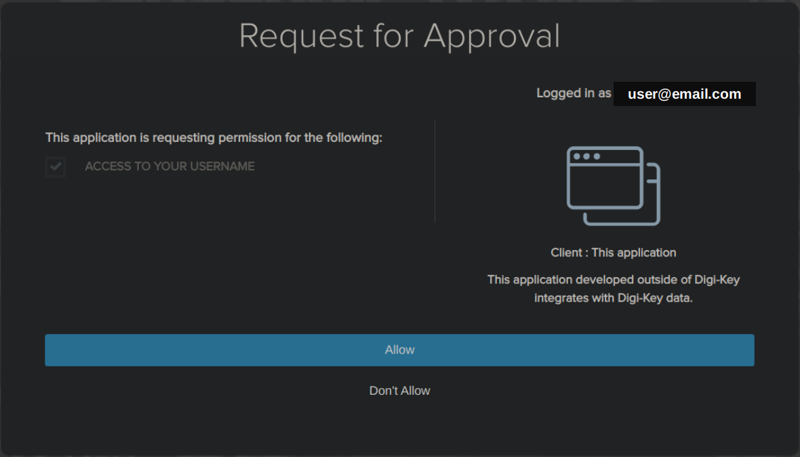

# Ki-nTree
#### Fast part creation in [KiCad](https://kicad-pcb.org/) and [InvenTree](https://github.com/inventree/inventree) -> [see it in action!](https://youtu.be/NSMfCCD0uVw)


## Introduction
Ki-nTree (pronounce "Key Entry" or "Key 'n' Tree") aims to:
* automate part creation of KiCad library parts
* automate part creation of InvenTree parts
* synchronize parts data between KiCad and InvenTree

Ki-nTree works with:
- Digi-Key's **enormous** part database and [free API](https://developer.digikey.com/)
- the awesome open-source [Digi-Key API python library](https://github.com/peeter123/digikey-api) built and maintained by [@peeter123](https://github.com/peeter123)
- the awesome open-source [InvenTree Inventory Management System](https://github.com/inventree/inventree) built and maintained by [@SchrodingersGat](https://github.com/SchrodingersGat)
- [KiCad](https://kicad-pcb.org/) (of course!) and their open-source [library utils](https://github.com/KiCad/kicad-library-utils)

Ki-nTree was developped by [@eeintech](https://github.com/eeintech) for [SPARK Microsystems](https://www.sparkmicro.com/), who generously accepted to make it open-source!

## Get Started
### Installation
1. Clone this repository with the `--recurse-submodules` option:
```
$ git clone --recurse-submodules https://github.com/sparkmicro/Ki-nTree
```
Alternatively, you can clone without the `--recurse-submodules` option, then run:
```
$ git submodule update --init
```
2. Create and activate a new python environment (Python 3.6+) inside the `Ki-nTree` folder:
```
$ cd Ki-nTree
$ python3 -m venv env-kintree
$ source env-kintree/bin/activate
```
3. Run `pip install -r requirements.txt` to install dependencies
4. Run `python kintree_gui.py` to start using Ki-nTree

#### Make it an executable
1. Make sure you followed the previous installation steps, then run:
```
$ make all
```
2. It will create a one-file executable in a new `dist` folder. You can now run it with `dist/kintree_gui` or simply double-clicking the `kintree_gui` file
3. Make also create a TGZ file in the `dist` folder so that you can extract Ki-nTree and store it anywhere on your computer

### Usage Instructions
#### Requirements
* Ki-nTree requires a Digi-Key **production** API instance. To create one, go to https://developer.digikey.com/. Create an account, an organization and add a **production** API to your organization. Save both Client ID and Secret keys.
* Ki-nTree was developped and tested only on a Linux system with Python 3.8.x (should be compatible with Python 3.6+)

#### Settings
1. With Ki-nTree GUI open, click on "Settings > Digi-Key" and fill in both Digi-Key API Client ID and Secret keys (optional: click on "Test" to [get an API token](https://github.com/sparkmicro/Ki-nTree/tree/0.2.rc#part-number-search))
2. Click on "Settings > KiCad", browse to the location where KiCad symbol and footprint libraries are stored on your computer then click "Save"
3. If you intend to use InvenTree with this tool, click on "Settings > InvenTree" and fill in your InvenTree server address and credentials then click "Save" (optional: click on "Test" to get an API token)

#### Part Number Search
1. In the main window, enter the part number and click "OK", it will start by fetching part data using the Digi-Key API
2. In the case the Digi-Key API token is not found or expired, a browser window will pop-up. Enter your Digi-Key developper account credentials then login. The following page will appear (`user@email.com` will show your email address):



Click on "Allow", another page will open.  
Click on the "Advanced" button, then click on "Proceed to localhost (unsafe)" at the bottom of the page:


Lastly, a new page will open with a "You may now close this window." message, do so to proceed with the search.

3. Once the part data has been successfully fetched from Digi-Key, you will be prompted to add/confirm/edit the `Category` and `Subcategory` to use for this part (Ki-nTree tries to match them automatically)  
4. Then, you will be prompted with selecting the KiCad symbol library, template and footprint library to use for this part  
5. It will take some time to complete the part creation in InvenTree and/or KiCad, once it finishes you'll be notified of the result  
6. Finally, if the part was created or found in InvenTree, your browser will automatically open a new tab with the part information

Enjoy!

*For any problem/bug you find, please [report an issue](https://github.com/sparkmicro/Ki-nTree/issues).*

## Roadmap
#### Version 0.2
- [ ] Get more users to try it and release stable version with bug fixes

#### Version 0.3
Main goals: Improve GUI/user input and implement part synchronization between KiCad and InvenTree

##### Global
- [ ] Inform user of part creation progress in UI and terminal
- [ ] Combine all KiCad templates in a single library file (lib+dcm)

##### GUI
- [ ] Improve cosmetics (!)
- [ ] Show form prefilled with part API search results and allow user edits
- [ ] Add icon to GUI and executable (not successful in 0.2, try with PySimpleGUIQt?)
